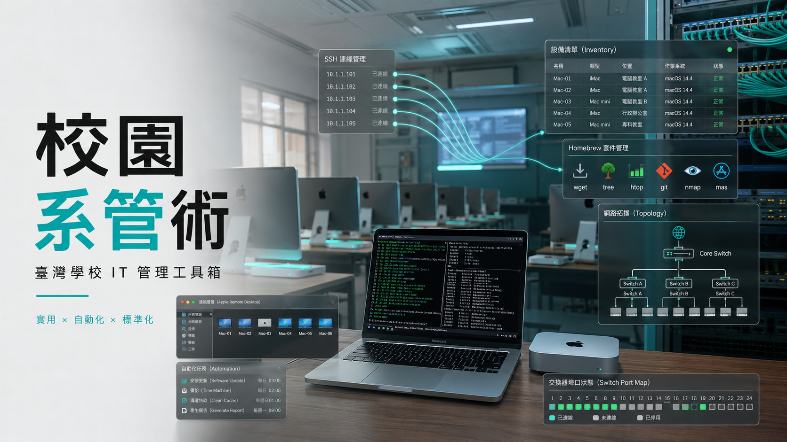

# 🏫 School IT Toolkit — English guide

<p align="center">
  
</p>

Battle-tested probing, fleet-management, and **hard-won pitfall** know-how from a
school IT admin — packaged so any school can adopt it fast. This toolkit
**shares methods, not data** — given back to the community for free, not sold.

> The most complete documentation is in Traditional Chinese under [`../zh-TW/`](../zh-TW/).
> The two flagship guides and this overview are available in English.

---

## ⭐ Flagship guides (English)
1. [Onboard SSH across the fleet via Apple Remote Desktop](ssh-onboarding-via-ard.md)
2. [Fleet-wide Homebrew: install & keep up to date](homebrew-fleet.md)

Full pitfall catalogue (zh-TW): [`../zh-TW/pitfalls.md`](../zh-TW/pitfalls.md)

---

## 🎯 Who is this for

Built for schools that manage a fleet of Macs **by hand, without an MDM**. A good fit if:

- You have a fleet of **macOS** computers (Mac mini / iMac), mostly **Apple Silicon**
  (some features assume the `/opt/homebrew` path).
- You have **no MDM** (Jamf / Mosyle / Intune) and currently click through Apple Remote
  Desktop (ARD) one machine at a time.
- **ARD is available** as the first onboarding channel, and your admin machine is on the
  **same reachable LAN** as the Macs.
- The admin is comfortable managing over **SSH / CLI** (Python 3 available).
- Scale is roughly **tens of machines** (classroom / computer-lab fleets).
- *(Optional)* CLI-manageable **switches**, web-manageable **IP phones**, or a Mac running
  a **local LLM** server.
- You have **legitimate authority** over the machines (this performs SSH / sudo / password
  operations).

**Probably not for you** if you already run an MDM (use that instead), manage
**Windows / ChromeOS** (macOS only), or lack authorization over the target machines.

---

## 🚀 Quickstart

> ⚠️ **Use `git clone` — do NOT hand someone a copy of your folder.** `.gitignore` keeps
> secrets out of Git, but it does **not** stop a folder copy (`cp` / zip / AirDrop). After
> you run the wizard, your local folder contains private keys and passwords and must never
> be shared.

```bash
git clone <your-fork-url> school-it-toolkit
cd school-it-toolkit

# Setup wizard: asks for your subnet, accounts, key path, then generates
# config and an SSH key LOCALLY (never committed to Git).
python3 setup/init-wizard.py
```

---

## 🔐 Security

- 🔑 SSH private keys are generated **locally by the wizard**; the repo holds zero keys.
- 🚫 Credentials (`*.env`), real inventories (`inventory/*.csv`), scan outputs
  (`reports/`), switch configs, and the generated site are all gitignored. Only
  `*.example` templates are tracked.
- 📦 To share offline, export a clean archive of committed files only (no `.git`, no
  ignored secrets):
  ```bash
  git archive --format=zip -o school-it-toolkit-clean.zip HEAD
  ```

---

## ⚖️ License
[MIT](../../LICENSE) — free for any school to use, modify, and redistribute.
